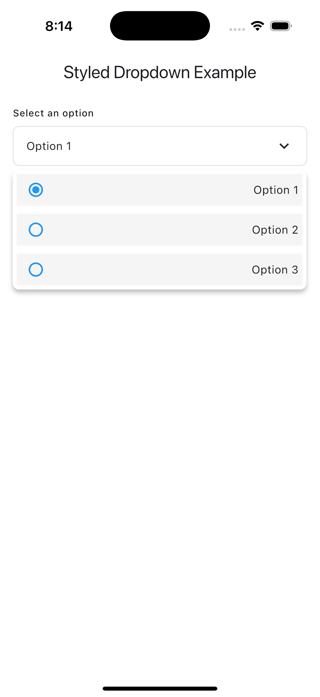
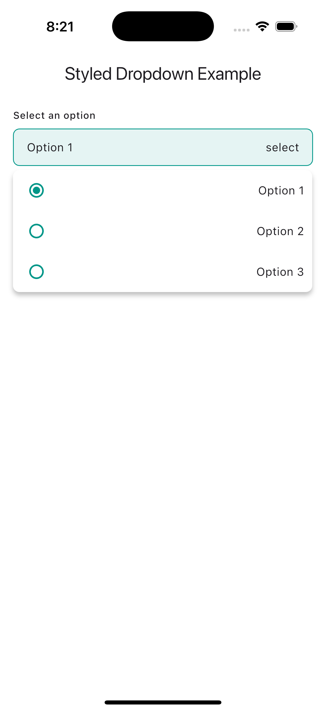
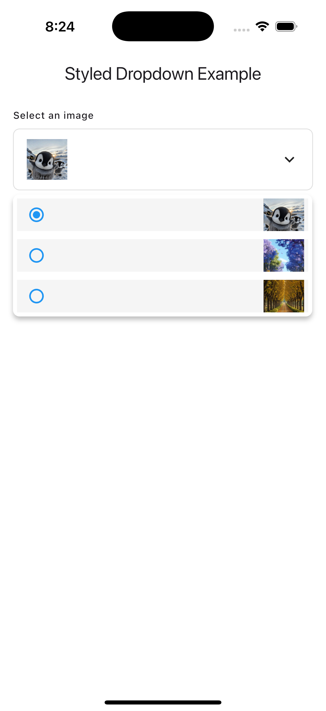
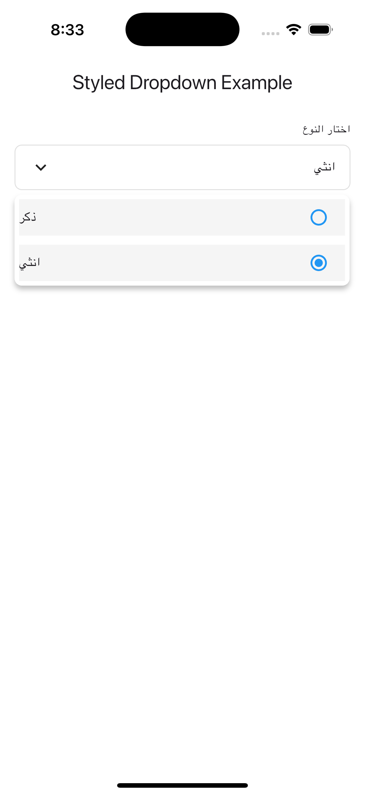

# styled_dropdown

A highly customizable dropdown widget for Flutter that displays a menu in an overlay with radio button selection.


## Screenshots

Here are some screenshots of the application:

| Screenshot 1 | Screenshot 2 |
|-------------|-------------|
|  |  |
| Screenshot 3 | Screenshot 4 |
|  |  |


## Features

- Customizable appearance with various styling options
- Radio button selection for items
- Support for text and image items
- Customizable dropdown menu height and positioning
- RTL and LTR text direction support
- Overlay-based dropdown that doesn't interfere with other UI elements


## Installation

Add this to your package's `pubspec.yaml` file:

```yaml
dependencies:
  styled_dropdown: ^1.0.0
```

Then run:

```bash
$ flutter pub get
```

## Usage

### Basic Usage

```dart
import 'package:flutter/material.dart';
import 'package:styled_dropdown/styled_dropdown.dart';

StyledDropDown(
  label: 'Select an option',
  value: selectedValue,
  items: ['Option 1', 'Option 2', 'Option 3'],
  onChanged: (value) {
    setState(() {
      selectedValue = value;
    });
  },
)
```

### With Custom Styling

```dart
StyledDropDown(
  label: 'Choose a color',
  value: selectedColor,
  items: colorOptions,
  onChanged: (value) {
    setState(() {
      selectedColor = value;
    });
  },
  mainContainerColor: Colors.grey[100],
  mainContainerRaduis: BorderRadius.circular(12),
  mainContainerBorder: Border.all(color: Colors.blue),
  itemContainerColor: Colors.white,
  activeColorbtn: Colors.green,
  maxHeight: 250,
  labelStyle: TextStyle(fontWeight: FontWeight.bold),
  valueTextStyle: TextStyle(color: Colors.blue),
  itemTextStyle: TextStyle(fontStyle: FontStyle.italic),
)
```

### Using Images

```dart
StyledDropDown(
  label: 'Select an image',
  value: selectedImage,
  items: imageAssetPaths,
  onChanged: (value) {
    setState(() {
      selectedImage = value;
    });
  },
  itemIsImage: true,
)
```

## Parameters

| Parameter | Type | Default | Description |
|-----------|------|---------|-------------|
| `label` | `String?` | `null` | Optional label displayed above the dropdown. |
| `value` | `String` | Required | The currently selected value. |
| `items` | `List<String>` | Required | The list of items to display in the dropdown menu. |
| `onChanged` | `Function(String)` | Required | Callback invoked when a new item is selected. |
| `maxHeight` | `double` | `300.0` | Maximum height of the dropdown menu. |
| `menuRightPadding` | `double` | `5.0` | Right padding for the dropdown menu. |
| `mainContainerColor` | `Color?` | `Colors.white` | Background color of the main dropdown container. |
| `mainContainerRaduis` | `BorderRadiusGeometry?` | `BorderRadius.all(Radius.circular(8))` | Border radius of the main dropdown container. |
| `mainContainerBorder` | `BoxBorder?` | `Border.fromBorderSide(BorderSide(color: Color(0xFFE0E0E0)))` | Border of the main dropdown container. |
| `dropIcon` | `Widget?` | `Icon(Icons.keyboard_arrow_down)` | Icon displayed in the dropdown container. |
| `itemContainerColor` | `Color?` | `Color(0xFFF5F5F5)` | Background color of the item containers. |
| `itemContainerHight` | `double?` | `40.0` | Height of each item in the dropdown menu. |
| `itemDirection` | `TextDirection` | `TextDirection.ltr` | Text direction of the items in the dropdown menu. |
| `itemIsImage` | `bool?` | `false` | Whether items should be displayed as images. |
| `activeColorbtn` | `Color?` | `Colors.blue` | Color of the active radio button. |
| `fillColorbtn` | `Color?` | `Colors.blue` | Fill color of the radio button. |
| `labelStyle` | `TextStyle?` | `Theme.of(context).textTheme.labelMedium` | Text style for the dropdown label. |
| `itemTextStyle` | `TextStyle?` | `Theme.of(context).textTheme.bodyMedium` | Text style for the items in the dropdown menu. |
| `valueTextStyle` | `TextStyle?` | `Theme.of(context).textTheme.bodyMedium` | Text style for the selected value displayed in the dropdown button. |

## Example

```dart
import 'package:flutter/material.dart';
import 'package:styled_dropdown/styled_dropdown.dart';

void main() {
  runApp(const MyApp());
}

class MyApp extends StatelessWidget {
  const MyApp({Key? key}) : super(key: key);

  @override
  Widget build(BuildContext context) {
    return MaterialApp(
      title: 'StyledDropDown Example',
      theme: ThemeData(
        primarySwatch: Colors.blue,
      ),
      home: const MyHomePage(),
    );
  }
}

class MyHomePage extends StatefulWidget {
  const MyHomePage({Key? key}) : super(key: key);

  @override
  State<MyHomePage> createState() => _MyHomePageState();
}

class _MyHomePageState extends State<MyHomePage> {
  String selected = 'Option 1';
  final List<String> items = ['Option 1', 'Option 2', 'Option 3'];

  @override
  Widget build(BuildContext context) {
    return Scaffold(
      backgroundColor: Colors.white,
      appBar: AppBar(
        title: const Text('Styled Dropdown Example'),
        backgroundColor: Colors.white,
      ),
      body: Column(
        children: [
          
           Padding(
            padding: const EdgeInsets.all(16.0),
            child: StyledDropDown(
              label: 'Select an option', 
              value: selected,
              items: items,
              onChanged: (value) {
                setState(() {
                  selected = value;
                });
              },
              maxHeight: 200, 
              menuRightPadding: 1.0,
            ),
          ),
        ],
      ),
    );
  }
}
```

## License

This project is licensed under the MIT License - see the LICENSE file for details.

## Contributing

Contributions are welcome! Please feel free to submit a Pull Request.

## Additional information

For issues, feature requests or additional information, please visit the [GitHub repository](https://github.com/wogoodwael/styled_drop_down.git) or contact the author.
